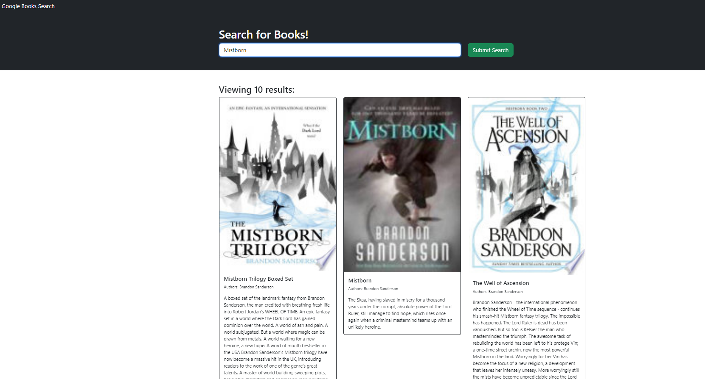

# 21-Challenge-Book-Search-Engine

        
## Description
            
This project is refactored Google Books API search engine to now use a GraphQL API and Apollo Server.

I built this application as a way to increase its functionality from a developer's perspective by using more modern technologies as a base.

By completing this project, I have a better understanding of how to effectively refactor an application and how to implement GraphQL API and an Apollo Server. 

### Screenshots of the deployed application:

- The application's search functionality in action:

## Table of Contents
            
- [Installation](#installation)
- [Usage](#usage)
- [License](#license)
- [Contributing](#contributing)
- [Tests](#tests)
- [Questions](#questions)
            
## Installation

To install this application, you'll need to clone the repository to your local machine. [Refer to this guide from GitHub if you need help.](https://docs.github.com/en/repositories/creating-and-managing-repositories/cloning-a-repository/)

Once cloned, you will need to navigate to the project's folder in your terminal then add the project's dependencies and run the application. 

You can do both by entering the following on one line: `npm i; npm run develop`.
            
## Usage

To simply use the deployed application, visit a link to the website deployed on Render here:

- https://two1-challenge-book-search-engine.onrender.com/

Otherwise, if you would prefer to host the application locally, follow the steps in [Installation](#installation). 
            
## License
            
MIT License

Copyright (c) 2024 isaacfallon
            
Permission is hereby granted, free of charge, to any person obtaining a copy
of this software and associated documentation files (the "Software"), to deal
in the Software without restriction, including without limitation the rights
to use, copy, modify, merge, publish, distribute, sublicense, and/or sell
copies of the Software, and to permit persons to whom the Software is
furnished to do so, subject to the following conditions:
            
The above copyright notice and this permission notice shall be included in all
copies or substantial portions of the Software.
            
THE SOFTWARE IS PROVIDED "AS IS", WITHOUT WARRANTY OF ANY KIND, EXPRESS OR
IMPLIED, INCLUDING BUT NOT LIMITED TO THE WARRANTIES OF MERCHANTABILITY,
FITNESS FOR A PARTICULAR PURPOSE AND NONINFRINGEMENT. IN NO EVENT SHALL THE
AUTHORS OR COPYRIGHT HOLDERS BE LIABLE FOR ANY CLAIM, DAMAGES OR OTHER
LIABILITY, WHETHER IN AN ACTION OF CONTRACT, TORT OR OTHERWISE, ARISING FROM,
OUT OF OR IN CONNECTION WITH THE SOFTWARE OR THE USE OR OTHER DEALINGS IN THE
SOFTWARE.
            
## Contributing

N/A
            
## Tests

N/A
     
## Questions
            
If you have any questions, please reach out at either of the following:
            
### GitHub profile:
- https://github.com/isaacfallon

### Email:
- isaac.fallon@gmail.com